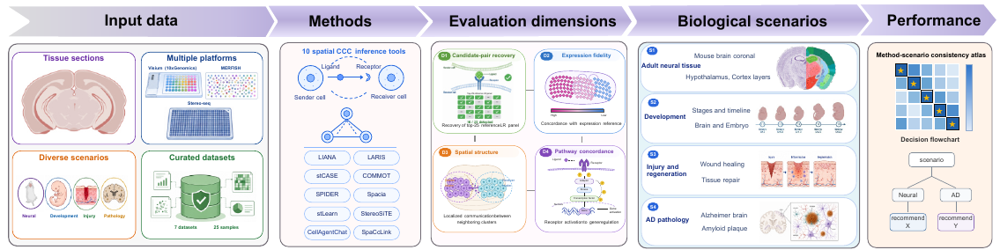
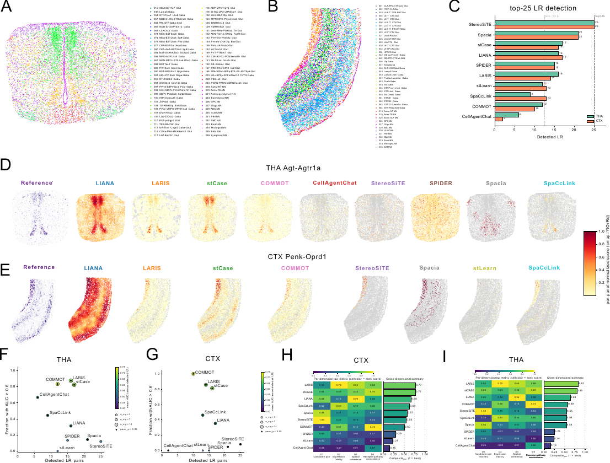

# SpaCCBench: a scenario-aware four-dimensional benchmark for spatial cell-cell communication

SpaCCBench evaluates spatial cell-cell communication inference methods along
four complementary dimensions: candidate-pair recovery (D1), expression
fidelity (D2), spatial coherence (D3), and receptor-pathway concordance (D4).
It provides a common adapter interface, species-stratified ligand-receptor
resources, shared score-matrix harmonization, and documented tools for applying
the benchmark to prepared datasets and method outputs.

## Benchmark overview

*Figure 1. Overview of the SpaCCBench four-dimensional evaluation framework.*

## Installation

~~~bash
pip install git+https://github.com/coffeei1i/spaccbench.git
~~~

SpaCCBench requires Python 3.9 or newer.

## Four-dimensional framework

| Dimension | Primary metric | Evaluation question |
|---|---|---|
| D1 | Candidate-pair recovery | Does a method emit non-trivial scores for the expression-informed candidates? |
| D2 | Pearson correlation | Do per-cell method scores agree with the expression-derived reference signal? |
| D3 | Moran's I | Are inferred communication scores spatially coherent? |
| D4 | Mean AUC | Do detected interactions track receptor-associated pathway activity? |

A cohort-level geometric composite summarizes rank-normalized D1-D4 scores
while penalizing uneven performance across dimensions.

## Reported manuscript summaries

*Figure 2. Four-dimensional evaluation of ten spatial CCC methods on THA and CTX MERFISH.*

The compact method-level tables underlying the THA and CTX benchmark atlas are
provided as [`THA_method_scores.csv`](examples/results/THA_method_scores.csv)
and [`CTX_method_scores.csv`](examples/results/CTX_method_scores.csv). These
are static publication-facing summaries, not files generated during package
installation or testing. See the [results column guide](examples/results/README.md)
for metric definitions. Large per-cell ligand-receptor score matrices remain
outside Git.

## Evaluating another method

The code below is an integration template, not a no-data example. It requires a
prepared scenario bundle and a method score matrix whose cell barcodes match
that scenario. The installed package includes the benchmark code and small
LR/pathway resources, but not the THA/CTX scenario bundles or method outputs.
Prepare the external files as described in
[`tools/README.md`](tools/README.md), set `SPACCBENCH_DATA_DIR`, and return
the final cells-by-LR matrix from an adapter.

~~~python
import pandas as pd
from spaccbench import BaseAdapter, evaluate

class MyMethodAdapter(BaseAdapter):
    name = "MyMethod"

    def __init__(self, scores_path):
        self.scores_path = scores_path

    def load_scores(self, scenario):
        return pd.read_csv(self.scores_path, index_col=0)

result = evaluate(
    method=MyMethodAdapter("my_outputs/tha.csv"),
    scenario="tha",
)
~~~

See docs/extending.md for the adapter contract and
docs/output_harmonization.md for the common score-matrix format.

## Recomputing the shared D1-D4 evaluation

The shared evaluation starts from final cell-by-LR outputs produced by the ten
external methods. SpaCCBench applies the same D1-D4 implementation to those
prepared matrices.

- [`docs/method_runs.md`](docs/method_runs.md) records method versions and
  expected handoff files.
- [`manuscript_scripts/run_benchmark.py`](manuscript_scripts/run_benchmark.py)
  recomputes metrics from prepared inputs.
- [`examples/README.md`](examples/README.md) gives the expected directory layout.
- [`docs/data_access.md`](docs/data_access.md) identifies the source datasets.

## Citation

~~~bibtex
@article{spaccbench2026,
  title  = {SpaCCBench: a scenario-aware four-dimensional benchmark for spatial cell-cell communication},
  author = {Xu, Yiheng and Zhang, Zimu and Liu, Shuqi and Wang, Lifang and He, Youzhe and Li, Xiao-Ming and Yu, Bin},
  year   = {2026},
  note   = {Submitted to BMC Bioinformatics}
}
~~~

## Development

~~~bash
git clone https://github.com/coffeei1i/spaccbench.git
cd spaccbench
pip install -e ".[dev]"
pytest tests/
~~~

See [tests/README.md](tests/README.md) for the scope of each test module.

## License

MIT. See LICENSE.
